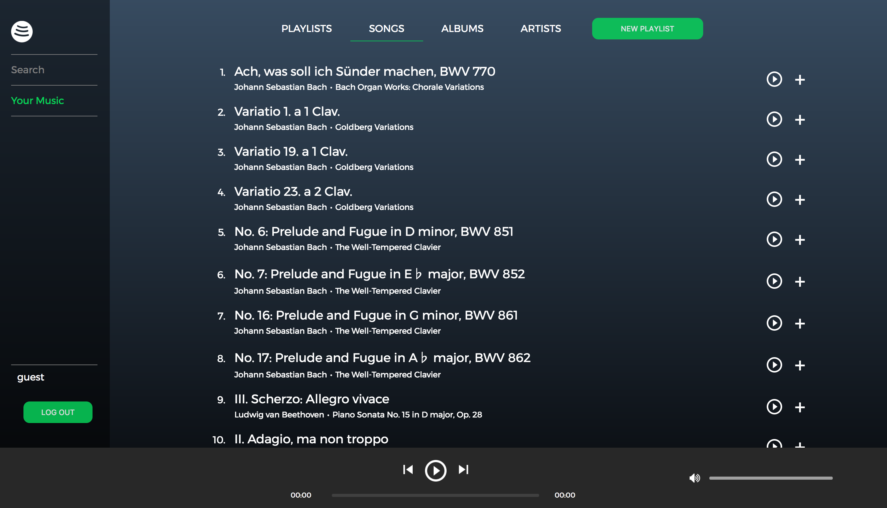
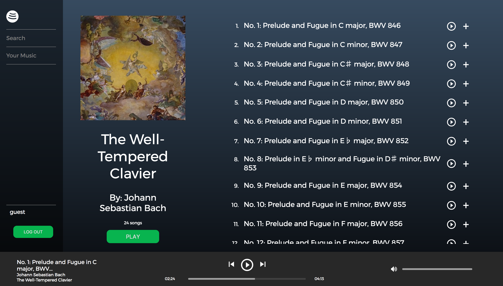

# Fraudify

[Fraudify live!](https://fraudify.herokuapp.com/#/home)

Fraudify is a full stack web application based on the popular music streaming service Spotify, built using Ruby on Rails and React/Redux.

## Features and Implementation

### My Music

Users have access to a My Music page, where they can view their created and followed playlists, along with all songs and albums associated with those playlists. Users can also see their followed artists and link to the artist show page to view that artist's songs and albums. The user's music data is fetched when visiting any of the My Music indexes by making AJAX requests to the Rails backend API using RESTful route conventions. ActiveRecord queries with eager loading were employed in order to serve the correct JSON data to the frontend, which is then stored in a global Redux state.

For example, selecting all of the songs on a user's created and followed playlists uses the following query:
```ruby
# app/models/song.rb

def self.user_songs(user)
  Song
    .joins(:playlists)
    .joins("LEFT OUTER JOIN follows ON follows.followable_id = playlists.id")
    .where("playlists.creator_id = ? OR follows.user_id = ?", user.id, user.id)
    .includes(:artist)
    .includes(:album)
    .distinct
end
```

Playlists can be created from anywhere on a user's My Music page by clicking the "New Playlist" button. By using a modular `SongsIndex` React component, songs can be added to any of the user's created playlists from any location that songs are viewable (playlist or album show pages, user's song index, artist show page, search results).



A user can follow both playlists and artists, which necessitated the use of a polymorphic ActiveRecord association.

### Continuous Sitewide Music Playback

Users can play music continuously while navigating around the site, which was achieved by nesting the `NowPlaying` component under the parent `App` route, so it is rendered on every page. Users can add all of a playlist's or album's songs to the play queue for continuous playback and can navigate through the queue using the next song and previous song buttons. It is also possible to clear the play queue and add a song for immediate playback by clicking on the play button next to a song in any `SongsIndex` component.



Audio playback is achieved using a custom audio player that manipulates an HTML5 `<audio>` element using React lifecycle methods and event listeners.

```javascript
// frontend/components/now_playing/audio_player.jsx

scrollPlayback(e) {
  e.preventDefault();
  e.stopPropagation();

  const timelineWidth = this.scrollbar.getBoundingClientRect().width;
  const timelineLeft = this.scrollbar.getBoundingClientRect().left;
  const clickPos = (e.clientX - timelineLeft) / timelineWidth;

  this.audio.currentTime = this.duration * clickPos;
  this.setState({ elapsed: this.audio.currentTime });
}

...

prevSong() {
  const playQueuePosition = this.state.playQueuePosition - 1;

  if (this.audio.currentTime > 2) {
    this.audio.currentTime = 0;
  } else {
    if (playQueuePosition < 0) {
      this.setState({ playQueuePosition: 0 });
    } else {
      this.props.receiveCurrentSong(this.props.playQueue[playQueuePosition]);
      this.props.pauseSong();
      this.setState({ playQueuePosition });
    }
  }
}  
```

### Search

Users can search for playlists, songs, albums, and artists. Using an `onChange` event handler which sends an API request on every keystroke, users can view dynamic search results at the press of a button. By making use of the Postgres `ILIKE` operator for case-insensitive matching, the search results fetched from the database are guaranteed to match the user's input as closely as possible. The search results are returned to the frontend and stored in the global Redux state while the user navigates through the search pages.

## Future Directions

* __Browse:__ users can browse popular songs, artists, playlists, and albums, with suggestions tailored to their preferences
* __Radio:__ users can create a radio station that will suggest songs based on an album or artist
* __User following__: users can search for and follow other users to add their playlists to My Music
