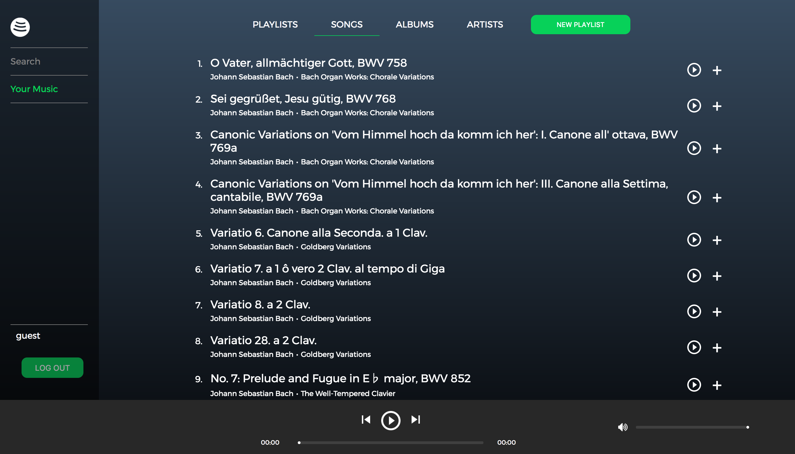
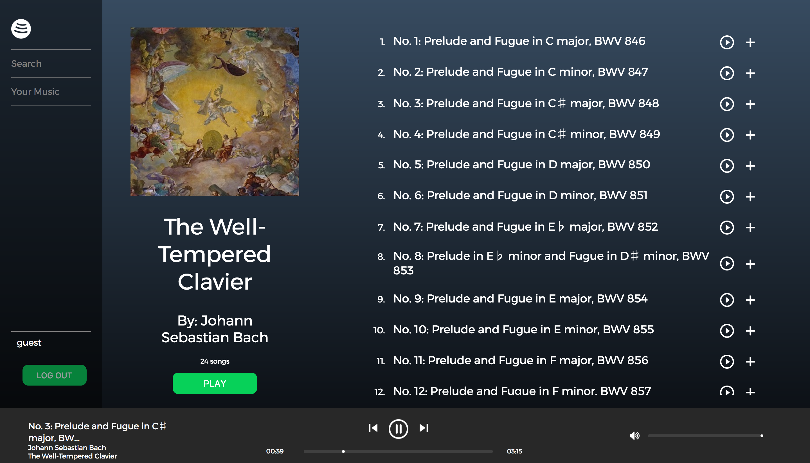

# Fraudify

[Fraudify live!](https://fraudify.herokuapp.com/#/home)

Fraudify is a full stack web application based on the popular music streaming service Spotify, built using Ruby on Rails and React/Redux.

## Features and Implementation

### My Music

Users have access to a My Music page, where they can view their created and followed playlists, along with all songs and albums associated with those playlists. Users can also see their followed artists and link to the artist show page to view that artist's songs and albums.

Playlists can be created from anywhere on a user's My Music page by clicking the "New Playlist" button. By using a modular `SongsIndex` component, songs can be added to any of the user's created playlists from any location that songs are viewable (playlist or album show pages, user's song index, artist show page, search results).



### Continuous Sitewide Music Playback

Users can play music continuously while navigating around the site, which was achieved by nesting the `NowPlaying` component under the parent `App` route, so it is rendered on every page. Users can add all of a playlist's or album's songs to the play queue for continuous playback and can navigate through the queue using the next song and previous song buttons. It is also possible to add a song to the top of the play queue for immediate playback by clicking on the play button next to a song in any `SongsIndex` component.



Audio playback is achieved using a custom audio player that manipulates an HTML5 `<audio>` element using React lifecycle methods and event listeners.

```jsx
<div className="audio-player">

  <audio
    id="audio"
    src={ audioUrl }
    ref={ audio => { this.audio = audio; } }
  />

  <div className="audio-left">
    <div className="song-controls">
      
      
      
    </div>
    
  ...
```

### Search

Users can search for playlists, songs, albums, and artists. Using an `onChange` event handler which sends an API request on every keystroke, users can view dynamic search results at the press of a button.


### Future Directions

* __Browse:__ users can browse popular songs, artists, playlists, and albums, with suggestions tailored to their preferences
* __Radio:__ users can create a radio station that will suggest songs based on an album or artist
* __User following__: users can search for and follow other users to add their playlists to My Music
